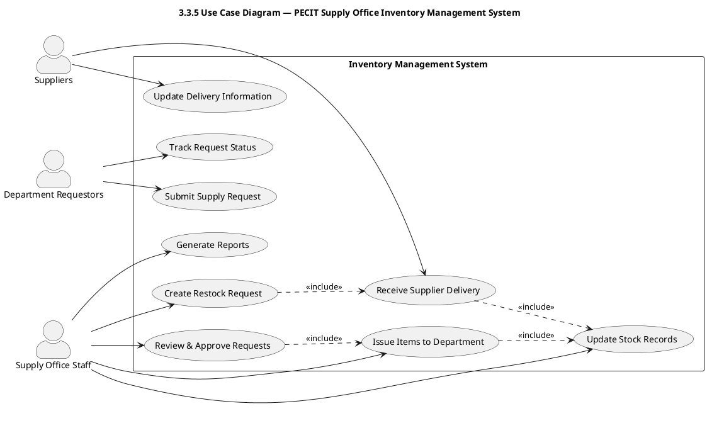

# 3.3.5 Use Case Diagram — PECIT Supply Office Inventory Management System

This use case diagram depicts the interactions between the primary users and the PECIT Supply Office Inventory Management System. The main actors include:

- Supply Office Staff: Responsible for managing inventory, processing departmental requests, updating stock records, and generating reports.
- Department Requestors: Submit supply requests and track request statuses.
- Suppliers: Provide supplies and update delivery information.

Render the diagram using PlantUML. Source file: `docs/thesis/3_3_5_use_case_diagram.puml`.

