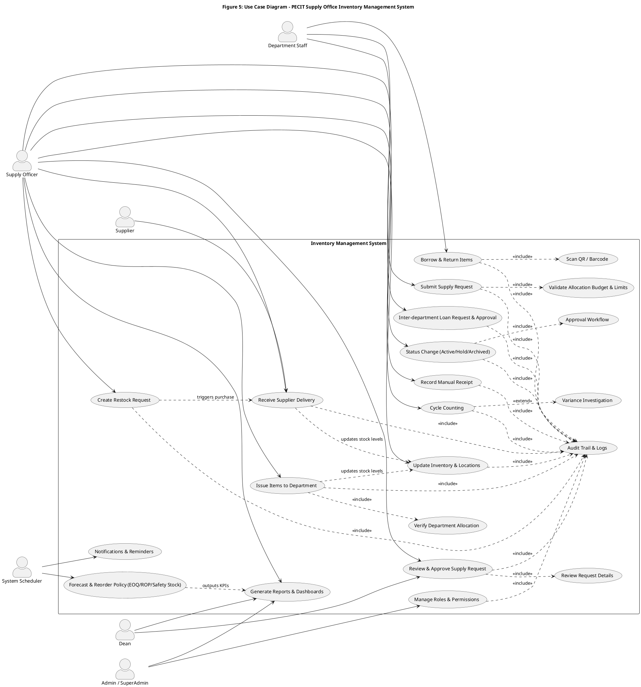

# Figure 5: Use Case Diagram — PECIT Supply Office Inventory Management System

This figure depicts the principal actors and use cases of the PECIT Supply Office Inventory Management System. Core actors include Department Staff, Supply Officer, Dean, Admin/SuperAdmin, Supplier, and a System Scheduler for automated tasks. Major use cases cover supply requests, approvals, issuing/borrowing/returning items, restocking and receiving deliveries, inventory/location updates, status changes, cycle counting, reporting, RBAC, audit logging, forecasting and reorder policies, and notifications. Audit logging is included in high‑risk and state‑changing actions to ensure traceability and compliance.

Render the diagram using PlantUML (desktop plugin or online renderer). The source below is identical to `figure_5_use_case.puml`:

